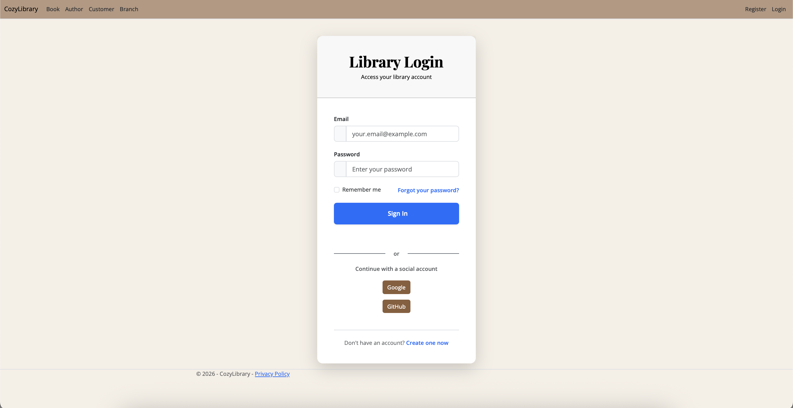
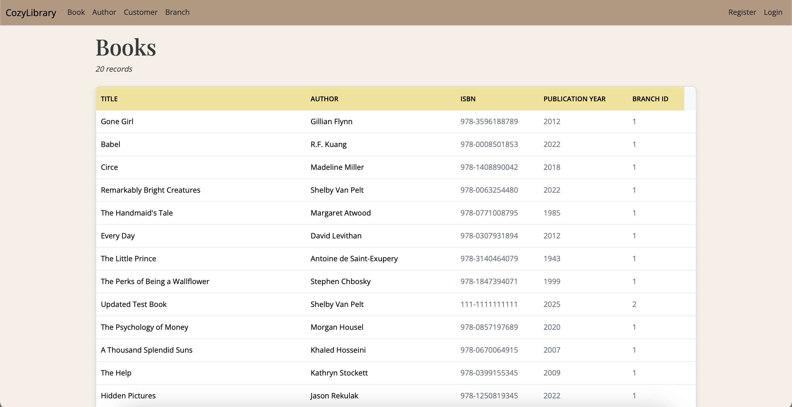
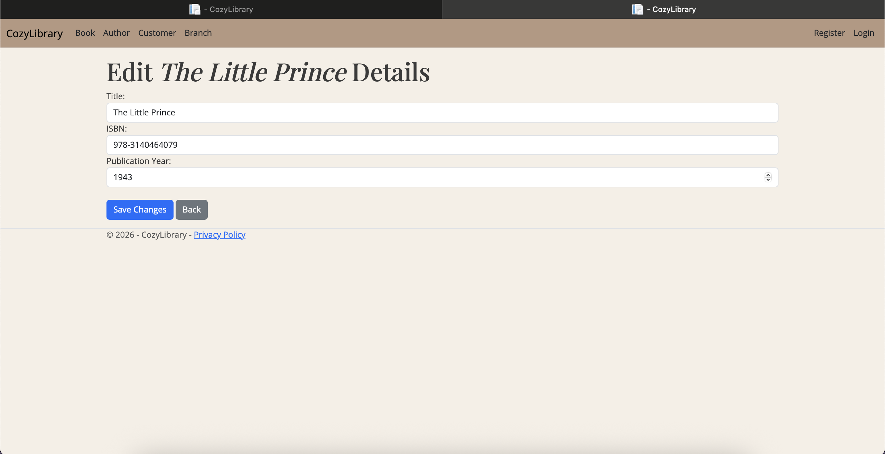
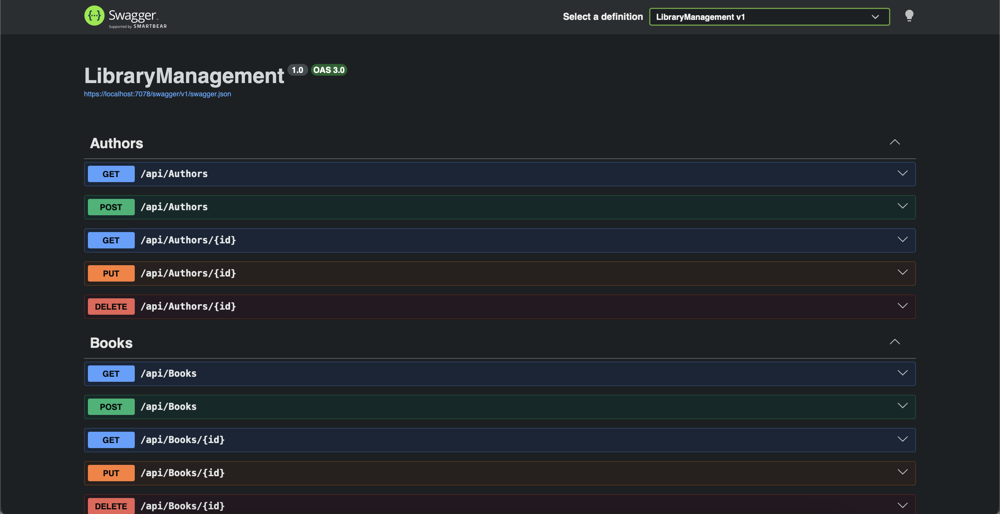
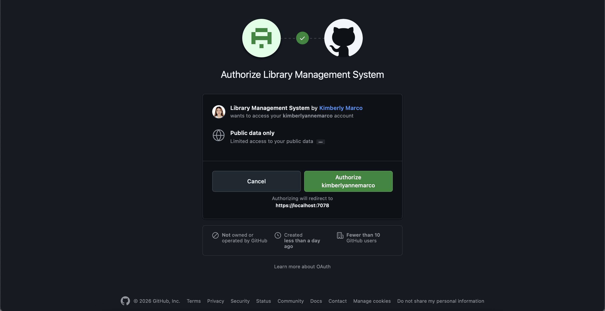

# Library Management System

A full-stack ASP.NET Core MVC application for managing library operations, including books, authors, customers, and library branches. The application provides secure authentication, RESTful APIs, automated testing, and interactive API documentation.

Built independently as part of a graduate-level software development course at Fairleigh Dickinson University.

## Features

### Library Management

* Manage books, authors, customers, and library branches
* Full Create, Read, Update, and Delete (CRUD) functionality
* Book rating and review system
* Relational database design with entity relationships

### Authentication & Security

* ASP.NET Core Identity authentication
* User registration and login
* Google OAuth integration
* GitHub OAuth integration
* Protected application functionality for authenticated users

### REST API

* RESTful API endpoints for core library entities
* Interactive API documentation using Swagger/OpenAPI
* JSON request and response support
* Structured endpoint design following REST conventions

### Testing

* 29 Unit Tests
* 24 Integration Tests
* Service layer validation
* API and database interaction testing

## Technology Stack

### Backend

* ASP.NET Core 8.0
* Entity Framework Core 8.0
* C#

### Database

* SQLite

### Authentication

* ASP.NET Core Identity
* Google OAuth
* GitHub OAuth

### Documentation & Testing

* Swagger/OpenAPI
* xUnit

### Development Tools

* Visual Studio Code
* Git
* GitHub

## Screenshots

### Login Page



### Library Catalog



### Edit Book



### API Documentation



### GitHub OAuth Authentication



## API Endpoints

The application exposes RESTful endpoints for:

* Books
* Authors
* Customers
* Library Branches

Examples:

```http
GET /api/books
POST /api/books
PUT /api/books/{id}
DELETE /api/books/{id}
```

Interactive API documentation is available through Swagger after launching the application.

## Getting Started

### Prerequisites

* .NET 8 SDK
* Visual Studio 2022 or Visual Studio Code

### Clone Repository

```bash
git clone https://github.com/kimberlyannemarco/aspnet-library-management-system.git
cd aspnet-library-management-system
```

### Restore Dependencies

```bash
dotnet restore
```

### Run Application

```bash
dotnet run --launch-profile https
```

The application will create the SQLite database automatically on first run.

## Project Structure

```text
LibraryManagement
├── Controllers
├── Models
├── Views
├── Data
├── Services
├── Middleware
├── Areas
├── Migrations
├── docs
└── TestsSupport
```

## Learning Outcomes

This project provided hands-on experience with:

* ASP.NET Core MVC application development
* REST API design and implementation
* Authentication and OAuth integration
* Entity Framework Core and relational databases
* Automated testing practices
* Software architecture and project organization

## Author

Kimberly Anne Marco

Master of Science in Computer Science
Fairleigh Dickinson University Vancouver
